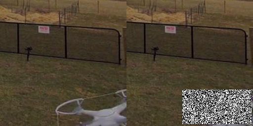
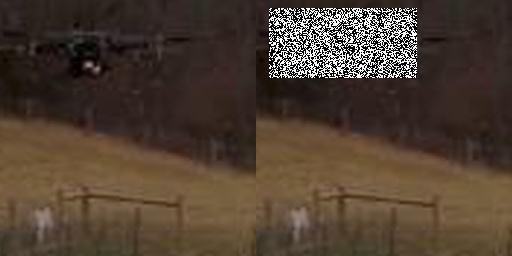

# Pedestrian-Synthesis-GAN
See arxiv: https://arxiv.org/abs/1804.02047
</br>
Pedestrian-Synthesis-GAN: Generating Pedestrian Data in Real Scene and Beyond
</img>
</br></br></br>

## Preparing
Prepare your data before training. The format of your data should follow the file in `datasets`. 
For training and testing phases, the path to data should be given to 
```
data_path 
i.e. --data_path ./dataset/autel 
```
where *autel* is the name of the dataset.
The train/test dataset is structured as follows:
```
./dataset/autel
               -bbox/
                     -1.json
                     -2.json
                      ....
               -images/
                     -1.jpeg
                     -2.jpeg
                      ....
```
An image *1.jpeg* for example is a sidebyside image of size *256x512x3* which consists of (on the left) the image with an object of interest, (on the right) the same image where the area corresponding to the bounding box of the object is replaced by salt-pepper noise. 

The corresponding *1.json* has the format
```
{'x1':10, 'y1':20, 'x2': 30, 'y2': 101}
``` 
which represents the bounding box in the (on the left) original image of the sidebyside image. 

### Three drone Dataset
Download three_drones dataset at [this](https://drive.google.com/file/d/1VP6Koz2xYzYsIVAJsmn0_JhasWuacCCq/view?usp=sharing)

Examples: 

</img>

</img>

## Training stage
```bash
python -m visdom.server
python train.py --dataroot data_path --name model_name --model pix2pix --which_model_netG unet_256 --which_direction BtoA --lambda_A 100 --dataset_mode aligned --use_spp --no_lsgan --norm batch
```

### Three drone Dataset
First, choose the drone type 
```
vi scripts/train_three_drones.sh
data_name=.... i.e: "autel", "fla_450"
```
Run training
```
python -m visdom.server
bash scripts/train_three_drones.sh
```

## Testing stage
```bash
python -m visdom.server
python test.py --dataroot data_path --name model_name --model pix2pix --which_model_netG unet_256 --which_direction BtoA  --dataset_mode aligned --use_spp --norm batch
```
## Vision
Run `python -m visdom.server` to see the training process.
</br>

</img>
</img>
</img>

### Three drone Dataset
First, choose the drone type 
```
vi scripts/test_three_drones.sh
data_name=.... i.e: "autel", "fla_450"
```
Run test 
```
python -m visdom.server
bash scripts/test_three_drones.sh
```

## Citation
If you find this work useful for your research, please cite:
```
@article{ouyang2018pedestrian,
  title={Pedestrian-Synthesis-GAN: Generating Pedestrian Data in Real Scene and Beyond},
  author={Ouyang, Xi and Cheng, Yu and Jiang, Yifan and Li, Chun-Liang and Zhou, Pan},
  journal={arXiv preprint arXiv:1804.02047},
  year={2018}
}
```

## Acknowledgments
Heavily borrow the code from <a href="https://github.com/junyanz/pytorch-CycleGAN-and-pix2pix">pix2pix</a>

